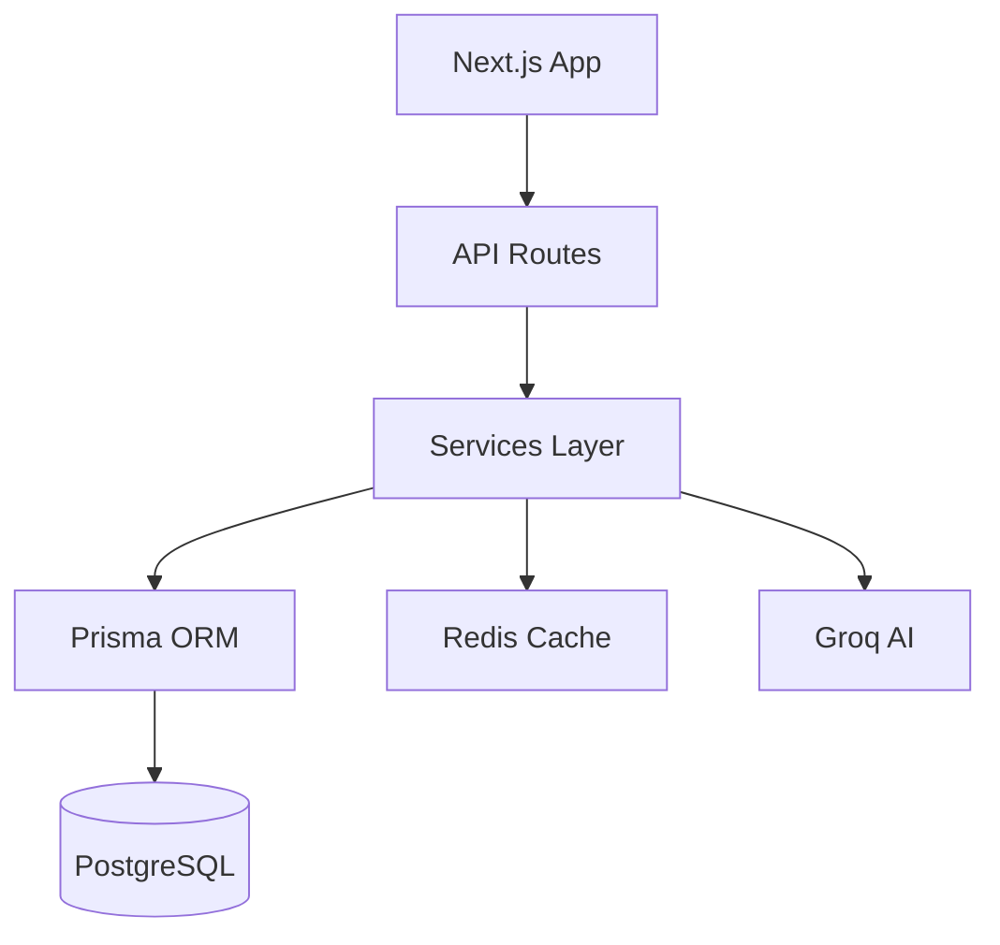

# LearnAI Academy - Expert Evaluation & Recommendations Report

**Evaluation Date:** 2025-11-08
**Total Code Size:** ~763 lines of JavaScript/TypeScript
**Tech Stack:** Next.js 14, React 18, Prisma ORM, PostgreSQL, Redis, Groq AI
**Project Type:** Full-stack K-12 AI Tutoring Platform

---

## Executive Summary

LearnAI Academy is a well-architected AI-powered education platform with strong foundations in modern web development practices. The project demonstrates solid engineering principles with modular design, clear separation of concerns, and intelligent AI integration. However, there are critical areas requiring attention, particularly around **testing**, **security hardening**, **error handling**, and **performance optimization**.

**Overall Grade:** B+ (Good, but needs refinement)

**Strengths:**
- Clean, modular architecture with clear separation of concerns
- Strong AI integration with subject-specific agents
- Comprehensive database schema with proper relationships
- Redis caching for performance optimization
- Zod validation for type safety
- Responsive UI with modern React patterns

**Critical Areas for Improvement:**
- **No automated testing** (0% coverage)
- Security vulnerabilities in authentication and API design
- Missing monitoring and observability
- Limited error handling and user feedback
- No CI/CD pipeline
- Performance optimization opportunities
- Missing rate limiting implementation

---

## 1. Architecture & Code Quality Assessment

### 1.1 Architecture (Grade: A-)

**Strengths:**
✅ Excellent modular design with clear service layer pattern
✅ Proper separation of frontend (components) and backend (API routes, services)
✅ Well-organized directory structure following Next.js best practices
✅ Service-oriented architecture (AI services, analytics, cache)
✅ Singleton patterns for shared resources (Groq client, Prisma, Redis)
✅ Agent-based AI architecture with subject-specific agents

**Weaknesses:**
⚠️ Some circular dependency risks between services
⚠️ Missing API versioning (no `/api/v1/` structure)
⚠️ No clear separation between business logic and controllers in API routes

**Recommendations:**

1. **Implement API Versioning**
   ```
   /api/v1/auth/login
   /api/v1/sessions/...
   ```
   This allows breaking changes without affecting existing clients.

2. **Extract Business Logic from API Routes**
   Create controller classes that handle business logic, keeping routes thin:
   ```
   /src/controllers/SessionController.js
   /src/controllers/AuthController.js
   ```

3. **Add Dependency Injection**
   Use a DI container to manage service dependencies and improve testability.

---

### 1.2 Frontend Code Quality (Grade: B)

**Strengths:**
✅ Modern React patterns with hooks
✅ Clean component composition
✅ Responsive design with Tailwind CSS
✅ Voice input/output integration (Speech Recognition API)
✅ Loading states and user feedback
✅ Toast notifications for user actions
✅ Mobile-friendly navigation

**Weaknesses:**
⚠️ **No error boundaries** - App will crash on component errors
⚠️ Token stored in localStorage (XSS vulnerability)
⚠️ No form validation on client side before submission
⚠️ Missing accessibility features (ARIA labels, keyboard navigation)
⚠️ No state management library (Redux, Zustand) - passing props through multiple levels
⚠️ Inline styles instead of Tailwind classes in some places
⚠️ No TypeScript (using JavaScript with potential type errors)

**Critical Issues:**

**1. XSS Vulnerability - Token Storage (CRITICAL)**

*Location:* `src/components/learning/ChatInterface.js:43`

```javascript
const token = localStorage.getItem('token');
```

**Problem:** Storing JWT in localStorage makes it vulnerable to XSS attacks. If an attacker injects malicious JavaScript, they can steal the token.

**Solution:** Use httpOnly cookies or implement a more secure token storage mechanism:
```javascript
// Instead of localStorage, use httpOnly cookies set by the backend
// OR use sessionStorage with additional XSS protections
```

**2. Missing Error Boundaries**

*Location:* All pages

**Problem:** If any component throws an error, the entire app crashes with a white screen.

**Solution:** Add error boundaries:
```javascript
// src/components/ErrorBoundary.js
class ErrorBoundary extends React.Component {
  static getDerivedStateFromError(error) {
    return { hasError: true };
  }
  componentDidCatch(error, errorInfo) {
    console.error('Error caught:', error, errorInfo);
  }
  render() {
    if (this.state.hasError) {
      return <ErrorFallback />;
    }
    return this.props.children;
  }
}
```

**3. No Client-Side Validation**

*Location:* Multiple form components

**Problem:** Forms submit without client-side validation, leading to unnecessary API calls.

**Solution:** Add Zod schemas on client side and validate before submission.

**Recommendations:**

1. **Migrate to TypeScript**
   - Adds type safety and catches errors at compile time
   - Improves IDE autocomplete and developer experience
   - Estimated effort: 2-3 weeks

2. **Implement State Management**
   - Use Zustand or Redux for global state (user, auth, settings)
   - Reduces prop drilling and improves code maintainability

3. **Add Accessibility Features**
   - ARIA labels for screen readers
   - Keyboard navigation support
   - Focus management for modals
   - Color contrast compliance (WCAG 2.1 AA)

4. **Implement Code Splitting**
   - Use Next.js dynamic imports for large components
   - Reduce initial bundle size
   ```javascript
   const ChatInterface = dynamic(() => import('@/components/learning/ChatInterface'));
   ```

---

### 1.3 Backend Code Quality (Grade: B+)

**Strengths:**
✅ Clean API route structure with Next.js Route Handlers
✅ Zod validation on all API endpoints
✅ JWT authentication with proper token verification
✅ Prisma ORM for type-safe database queries
✅ Error handling with try-catch blocks
✅ Content filtering for age-appropriate responses
✅ Homework cheating detection
✅ Redis caching for performance

**Weaknesses:**
⚠️ **No rate limiting implementation** (code exists but not used)
⚠️ Missing request logging and monitoring
⚠️ No API documentation (Swagger/OpenAPI)
⚠️ Inconsistent error response formats
⚠️ Database queries in loops (N+1 query problem)
⚠️ No database connection pooling configuration
⚠️ Missing database indexes for performance

**Critical Issues:**

**1. N+1 Query Problem (PERFORMANCE ISSUE)**

*Location:* `src/services/analytics/recommendationEngine.js:131-138`

```javascript
for (const childTopic of topic.childTopics) {
  const childProgress = await prisma.studentProgress.findUnique({
    where: { ... }
  });
}
```

**Problem:** Multiple database queries in a loop, causing performance degradation with many topics.

**Solution:** Use Prisma's `include` or batch queries:
```javascript
const progressRecords = await prisma.studentProgress.findMany({
  where: {
    studentId,
    topicId: { in: childTopicIds }
  }
});
```

**2. Missing Rate Limiting (SECURITY ISSUE)**

*Location:* All API routes

**Problem:** No rate limiting on API endpoints allows abuse and DoS attacks.

**Solution:** Implement rate limiting middleware:
```javascript
// src/middleware/rateLimit.js
import { cacheService } from '@/services/cache/cacheService';

export async function rateLimit(request, identifier, maxRequests = 100, windowSeconds = 60) {
  const key = `ratelimit:${identifier}:${request.url}`;
  const result = await cacheService.checkRateLimit(key, maxRequests, windowSeconds);

  if (!result.allowed) {
    throw new Error('Rate limit exceeded');
  }

  return result;
}
```

**3. Weak JWT Secret Handling**

*Location:* `src/lib/auth.js:12`

**Problem:** No validation that JWT_SECRET is strong enough.

**Solution:** Add secret validation on startup:
```javascript
if (!process.env.JWT_SECRET || process.env.JWT_SECRET.length < 32) {
  throw new Error('JWT_SECRET must be at least 32 characters');
}
```

**4. SQL Injection Risk (LOW - Prisma Protects)**

*Location:* All database queries

**Good News:** Prisma ORM provides protection against SQL injection by default. However, if you ever use `prisma.$queryRaw`, ensure proper parameterization.

**Recommendations:**

1. **Add Database Indexes**
   ```prisma
   model StudentProgress {
     @@index([studentId, masteryLevel])
     @@index([topicId, lastPracticedAt])
   }

   model LearningSession {
     @@index([studentId, startedAt])
     @@index([subjectId, sessionMode])
   }
   ```

2. **Implement API Documentation**
   Use Swagger/OpenAPI for auto-generated API docs:
   ```bash
   npm install swagger-ui-express swagger-jsdoc
   ```

3. **Add Request Logging**
   ```javascript
   import morgan from 'morgan';
   // Log all API requests with response times
   ```

4. **Standardize Error Responses**
   ```javascript
   // src/lib/errorHandler.js
   export class ApiError extends Error {
     constructor(statusCode, message, errors = []) {
       super(message);
       this.statusCode = statusCode;
       this.errors = errors;
     }
   }

   export function errorResponse(error) {
     return NextResponse.json({
       success: false,
       error: error.message,
       errors: error.errors || [],
       statusCode: error.statusCode || 500,
     }, { status: error.statusCode || 500 });
   }
   ```

---

## 2. Security Assessment (Grade: C+)

### 2.1 Critical Security Vulnerabilities

**CRITICAL ISSUES:**

**1. ❌ JWT Token in localStorage (XSS Risk)**
- **Severity:** CRITICAL
- **Location:** All frontend components
- **Impact:** Attackers can steal authentication tokens via XSS
- **Fix:** Use httpOnly cookies instead

**2. ❌ No Rate Limiting**
- **Severity:** HIGH
- **Location:** All API routes
- **Impact:** API abuse, DoS attacks, brute force attacks
- **Fix:** Implement rate limiting on auth and AI endpoints

**3. ❌ Weak Password Requirements**
- **Severity:** MEDIUM
- **Location:** `src/app/api/auth/register/route.js`
- **Impact:** Users can set weak passwords
- **Fix:** Enforce password complexity (min 12 chars, uppercase, lowercase, number, special char)

**4. ⚠️ No CSRF Protection**
- **Severity:** MEDIUM
- **Location:** All API routes
- **Impact:** Cross-site request forgery attacks
- **Fix:** Implement CSRF tokens for state-changing operations

**5. ⚠️ Missing Security Headers**
- **Severity:** MEDIUM
- **Location:** Next.js config
- **Impact:** Vulnerability to clickjacking, XSS, and other attacks
- **Fix:** Add security headers in `next.config.js`

**6. ⚠️ API Key Exposure Risk**
- **Severity:** MEDIUM
- **Location:** Environment variables
- **Impact:** If `.env` is committed, API keys are exposed
- **Fix:** Add `.env` to `.gitignore`, use secret management

**Recommendations:**

### Security Hardening Checklist

1. **Implement httpOnly Cookies for JWT**
   ```javascript
   // Set cookie on login
   response.cookies.set('token', token, {
     httpOnly: true,
     secure: process.env.NODE_ENV === 'production',
     sameSite: 'lax',
     maxAge: 604800, // 7 days
   });
   ```

2. **Add Security Headers**
   ```javascript
   // next.config.js
   async headers() {
     return [
       {
         source: '/:path*',
         headers: [
           { key: 'X-Frame-Options', value: 'DENY' },
           { key: 'X-Content-Type-Options', value: 'nosniff' },
           { key: 'X-XSS-Protection', value: '1; mode=block' },
           { key: 'Referrer-Policy', value: 'strict-origin-when-cross-origin' },
           { key: 'Permissions-Policy', value: 'camera=(), microphone=(), geolocation=()' },
         ],
       },
     ];
   },
   ```

3. **Enforce Strong Passwords**
   ```javascript
   const passwordSchema = z.string()
     .min(12, 'Password must be at least 12 characters')
     .regex(/[A-Z]/, 'Password must contain uppercase letter')
     .regex(/[a-z]/, 'Password must contain lowercase letter')
     .regex(/[0-9]/, 'Password must contain number')
     .regex(/[^A-Za-z0-9]/, 'Password must contain special character');
   ```

4. **Implement Account Lockout**
   - Lock account after 5 failed login attempts
   - Require email verification to unlock
   - Track failed attempts in Redis

5. **Add Content Security Policy (CSP)**
   ```javascript
   {
     key: 'Content-Security-Policy',
     value: "default-src 'self'; script-src 'self' 'unsafe-eval' 'unsafe-inline'; style-src 'self' 'unsafe-inline';"
   }
   ```

6. **Implement API Rate Limiting**
   - Auth endpoints: 5 requests/minute
   - AI endpoints: 20 requests/minute
   - General API: 100 requests/minute

7. **Add Input Sanitization**
   ```javascript
   import DOMPurify from 'isomorphic-dompurify';

   const sanitized = DOMPurify.sanitize(userInput);
   ```

8. **Enable Audit Logging**
   - Log all authentication attempts
   - Log API access with user IDs
   - Track sensitive operations (data deletion, exports)

---

## 3. Testing & Quality Assurance (Grade: F)

### 3.1 Current State

**Test Coverage:** 0%
**Test Files Found:** 0
**Testing Framework:** None installed

**Critical Issue:** The application has **NO automated tests**. This is the most significant technical debt and risk factor.

### 3.2 Recommended Testing Strategy

**1. Unit Tests (80% of tests)**
- Test individual functions and services
- Focus on: AI agents, recommendation engine, progress tracker, cache service

**2. Integration Tests (15% of tests)**
- Test API endpoints with database
- Focus on: auth flow, session management, progress updates

**3. E2E Tests (5% of tests)**
- Test critical user flows
- Focus on: signup → login → start session → chat → logout

### 3.3 Implementation Plan

**Phase 1: Setup Testing Infrastructure (Week 1)**

```bash
# Install testing dependencies
npm install --save-dev jest @testing-library/react @testing-library/jest-dom
npm install --save-dev @testing-library/user-event supertest
npm install --save-dev @prisma/client-jest
```

**Phase 2: Critical Unit Tests (Week 2-3)**

Priority test files to create:

1. `src/lib/auth.test.js` - JWT token generation/verification
2. `src/services/ai/groqClient.test.js` - AI client integration
3. `src/services/analytics/recommendationEngine.test.js` - Recommendation logic
4. `src/services/cache/cacheService.test.js` - Cache operations
5. `src/components/learning/ChatInterface.test.js` - Chat component

**Example Test:**
```javascript
// src/lib/auth.test.js
import { generateToken, verifyToken } from './auth';

describe('Authentication', () => {
  it('should generate valid JWT token', () => {
    const payload = { userId: '123', email: 'test@example.com' };
    const token = generateToken(payload);
    expect(token).toBeDefined();
    expect(typeof token).toBe('string');
  });

  it('should verify valid token', () => {
    const payload = { userId: '123', email: 'test@example.com' };
    const token = generateToken(payload);
    const decoded = verifyToken({ headers: { get: () => `Bearer ${token}` } });
    expect(decoded.userId).toBe('123');
  });

  it('should reject invalid token', () => {
    const decoded = verifyToken({ headers: { get: () => 'Bearer invalid' } });
    expect(decoded).toBeNull();
  });
});
```

**Phase 3: Integration Tests (Week 4)**

```javascript
// src/app/api/auth/login/route.test.js
import { POST } from './route';

describe('POST /api/auth/login', () => {
  it('should login with valid credentials', async () => {
    const request = new Request('http://localhost/api/auth/login', {
      method: 'POST',
      body: JSON.stringify({
        email: 'test@example.com',
        password: 'password123'
      }),
    });

    const response = await POST(request);
    const data = await response.json();

    expect(response.status).toBe(200);
    expect(data.success).toBe(true);
    expect(data.token).toBeDefined();
  });

  it('should reject invalid credentials', async () => {
    const request = new Request('http://localhost/api/auth/login', {
      method: 'POST',
      body: JSON.stringify({
        email: 'test@example.com',
        password: 'wrongpassword'
      }),
    });

    const response = await POST(request);
    const data = await response.json();

    expect(response.status).toBe(401);
    expect(data.error).toBeDefined();
  });
});
```

**Phase 4: E2E Tests (Week 5)**

```bash
npm install --save-dev playwright
```

```javascript
// tests/e2e/learning-flow.spec.js
import { test, expect } from '@playwright/test';

test('complete learning session flow', async ({ page }) => {
  // Login
  await page.goto('/login');
  await page.fill('input[type="email"]', 'student@example.com');
  await page.fill('input[type="password"]', 'password123');
  await page.click('button[type="submit"]');

  // Start session
  await page.goto('/learn');
  await page.click('text=Math');
  await page.click('text=Start Learning');

  // Send message
  await page.fill('textarea', 'What is 2+2?');
  await page.click('button:has-text("Send")');

  // Verify response
  await expect(page.locator('text=/4/')).toBeVisible();
});
```

**Target Metrics:**
- Unit test coverage: 80%+
- Integration test coverage: 60%+
- E2E test coverage: Critical paths only
- All tests passing in CI/CD before merge

---

## 4. Performance Optimization (Grade: B-)

### 4.1 Current Performance

**Strengths:**
✅ Redis caching for AI responses and progress data
✅ Lazy initialization for Groq and Redis clients
✅ Next.js automatic code splitting
✅ Prisma query optimization

**Weaknesses:**
⚠️ N+1 query problems in recommendation engine
⚠️ No database indexes on frequently queried columns
⚠️ Large bundle size (no analysis done)
⚠️ No image optimization
⚠️ Missing service worker for offline support
⚠️ No CDN for static assets

### 4.2 Optimization Recommendations

**1. Database Optimization**

Add indexes:
```prisma
model StudentProgress {
  @@index([studentId, masteryLevel])
  @@index([topicId, lastPracticedAt])
  @@index([subjectId])
}

model LearningSession {
  @@index([studentId, startedAt])
  @@index([subjectId, sessionMode])
}

model SessionMessage {
  @@index([sessionId, sequenceNumber])
}
```

**2. Query Optimization**

Replace loops with batch queries:
```javascript
// Before (N+1 problem)
for (const topic of topics) {
  const progress = await prisma.studentProgress.findUnique({ ... });
}

// After (single query)
const progressRecords = await prisma.studentProgress.findMany({
  where: { topicId: { in: topics.map(t => t.id) } }
});
```

**3. Caching Strategy Enhancement**

```javascript
// Implement cache warming for common queries
async warmCache() {
  const subjects = await prisma.subject.findMany();
  await cacheService.setCachedSubjects(subjects);

  // Warm popular topics
  const popularTopics = await prisma.topic.findMany({
    take: 100,
    orderBy: { /* by popularity */ }
  });
  // Cache each
}
```

**4. Image Optimization**

```javascript
// Use Next.js Image component
import Image from 'next/image';

<Image
  src={avatarUrl}
  alt="Avatar"
  width={48}
  height={48}
  loading="lazy"
/>
```

**5. Bundle Size Optimization**

```bash
# Analyze bundle
npm install --save-dev @next/bundle-analyzer

# next.config.js
const withBundleAnalyzer = require('@next/bundle-analyzer')({
  enabled: process.env.ANALYZE === 'true',
});

module.exports = withBundleAnalyzer(nextConfig);
```

**6. Implement Service Worker**

```javascript
// public/sw.js
self.addEventListener('fetch', (event) => {
  // Cache static assets
  // Offline fallback for API calls
});
```

**7. AI Response Streaming**

```javascript
// Implement SSE for streaming AI responses
export async function POST(request) {
  const stream = new ReadableStream({
    async start(controller) {
      const aiStream = await groqClient.streamChat(messages);
      for await (const chunk of aiStream) {
        controller.enqueue(chunk);
      }
      controller.close();
    }
  });

  return new Response(stream);
}
```

---

## 5. AI Integration (Grade: A-)

### 5.1 Strengths

✅ **Excellent agent architecture** with subject-specific agents
✅ Content filtering for age-appropriate responses
✅ Homework cheating detection
✅ Dynamic model selection based on complexity
✅ Token usage tracking and cost calculation
✅ Grade band-specific prompts (K-2, 3-5, 6-8, 9-12)
✅ Voice mode optimizations
✅ Context window management (last 10 messages)

### 5.2 Recommendations

**1. Implement Prompt Versioning**

```javascript
// src/services/ai/prompts/versions/v1.js
export const mathPromptV1 = { ... };

// src/services/ai/prompts/versions/v2.js
export const mathPromptV2 = { ... };

// Track which version performed better
```

**2. Add A/B Testing for Prompts**

```javascript
const promptVersion = Math.random() < 0.5 ? 'v1' : 'v2';
await agentLog.create({
  promptVersion,
  sessionId,
  studentRating, // Track user satisfaction
});
```

**3. Implement Fallback Models**

```javascript
async chat(messages, options = {}) {
  try {
    return await this._chatWithRetry('llama-3.1-70b-versatile', messages);
  } catch (error) {
    console.warn('Primary model failed, falling back');
    return await this._chatWithRetry('llama-3.1-8b-instant', messages);
  }
}
```

**4. Add Response Quality Scoring**

```javascript
async function scoreResponse(response, context) {
  return {
    relevance: calculateRelevance(response, context),
    clarity: assessClarity(response),
    ageAppropriate: checkAgeAppropriateness(response, context.gradeLevel),
    educational: evaluateEducationalValue(response),
  };
}
```

**5. Implement Conversation Memory**

```javascript
// Store conversation summaries for long-term memory
await prisma.conversationSummary.create({
  studentId,
  summary: await summarizeConversation(messages),
  keyTopics: extractTopics(messages),
  strengths: identifyStrengths(messages),
  weaknesses: identifyWeaknesses(messages),
});
```

**6. Add Multi-Model Support**

```javascript
// Support OpenAI, Anthropic, etc. as fallbacks
class MultiModelClient {
  async chat(messages, options) {
    const provider = this.selectProvider(options);

    switch(provider) {
      case 'groq': return await groqClient.chat(messages);
      case 'openai': return await openaiClient.chat(messages);
      case 'anthropic': return await anthropicClient.chat(messages);
    }
  }
}
```

---

## 6. Database Design (Grade: A)

### 6.1 Strengths

✅ Well-normalized schema with proper relationships
✅ Cascade deletes configured correctly
✅ Unique constraints on critical fields
✅ Enum types for type safety
✅ JSON fields for flexible metadata
✅ Timestamps on all tables
✅ UUID primary keys

### 6.2 Minor Improvements

**1. Add Missing Indexes**

Already covered in Performance section.

**2. Add Soft Deletes**

```prisma
model User {
  deletedAt DateTime?

  @@map("users")
}

// Query only active users
where: { deletedAt: null }
```

**3. Add Audit Trail**

```prisma
model AuditLog {
  id        String   @id @default(uuid())
  userId    String
  action    String   // CREATE, UPDATE, DELETE
  entityType String  // User, Student, Session
  entityId  String
  changes   Json?
  ipAddress String?
  userAgent String?
  createdAt DateTime @default(now())

  @@map("audit_logs")
}
```

**4. Add Data Retention Policy**

```javascript
// Cleanup old data periodically
async function cleanupOldData() {
  // Delete sessions older than 1 year
  await prisma.learningSession.deleteMany({
    where: {
      startedAt: { lt: new Date(Date.now() - 365 * 24 * 60 * 60 * 1000) }
    }
  });

  // Archive old messages
  await archiveMessages({ olderThan: 180 }); // 6 months
}
```

---

## 7. DevOps & Infrastructure (Grade: D+)

### 7.1 Current State

**Available:**
✅ Docker Compose for local development
✅ Vercel deployment guide
✅ Environment variable configuration

**Missing:**
❌ No CI/CD pipeline
❌ No automated deployments
❌ No monitoring or logging
❌ No error tracking (Sentry)
❌ No performance monitoring
❌ No backup strategy
❌ No disaster recovery plan
❌ No load testing

### 7.2 Recommendations

**1. Setup CI/CD Pipeline (GitHub Actions)**

```yaml
# .github/workflows/ci.yml
name: CI/CD Pipeline

on:
  push:
    branches: [main, develop]
  pull_request:
    branches: [main]

jobs:
  test:
    runs-on: ubuntu-latest
    steps:
      - uses: actions/checkout@v3
      - uses: actions/setup-node@v3
        with:
          node-version: 18
      - run: npm ci
      - run: npm run test
      - run: npm run lint

  build:
    needs: test
    runs-on: ubuntu-latest
    steps:
      - uses: actions/checkout@v3
      - run: npm ci
      - run: npm run build

  deploy:
    needs: build
    runs-on: ubuntu-latest
    if: github.ref == 'refs/heads/main'
    steps:
      - uses: actions/checkout@v3
      - uses: amondnet/vercel-action@v20
        with:
          vercel-token: ${{ secrets.VERCEL_TOKEN }}
          vercel-org-id: ${{ secrets.ORG_ID }}
          vercel-project-id: ${{ secrets.PROJECT_ID }}
```

**2. Add Error Tracking**

```bash
npm install @sentry/nextjs
```

```javascript
// sentry.client.config.js
import * as Sentry from '@sentry/nextjs';

Sentry.init({
  dsn: process.env.NEXT_PUBLIC_SENTRY_DSN,
  tracesSampleRate: 1.0,
  environment: process.env.NODE_ENV,
});
```

**3. Implement Logging**

```bash
npm install winston
```

```javascript
// src/lib/logger.js
import winston from 'winston';

export const logger = winston.createLogger({
  level: process.env.LOG_LEVEL || 'info',
  format: winston.format.json(),
  transports: [
    new winston.transports.File({ filename: 'error.log', level: 'error' }),
    new winston.transports.File({ filename: 'combined.log' }),
  ],
});

if (process.env.NODE_ENV !== 'production') {
  logger.add(new winston.transports.Console({
    format: winston.format.simple(),
  }));
}
```

**4. Add Monitoring**

```bash
npm install @vercel/analytics @vercel/speed-insights
```

```javascript
// app/layout.js
import { Analytics } from '@vercel/analytics/react';
import { SpeedInsights } from '@vercel/speed-insights/next';

export default function RootLayout({ children }) {
  return (
    <html>
      <body>
        {children}
        <Analytics />
        <SpeedInsights />
      </body>
    </html>
  );
}
```

**5. Database Backup Strategy**

```bash
# Daily automated backups
0 2 * * * pg_dump -U postgres learnai | gzip > /backups/learnai-$(date +\%Y\%m\%d).sql.gz

# Retention: Keep 7 daily, 4 weekly, 12 monthly
```

**6. Health Check Endpoint**

```javascript
// app/api/health/route.js
export async function GET() {
  const checks = {
    database: await checkDatabase(),
    redis: await checkRedis(),
    groq: await checkGroqAPI(),
  };

  const healthy = Object.values(checks).every(c => c.status === 'ok');

  return Response.json({
    status: healthy ? 'healthy' : 'unhealthy',
    checks,
    timestamp: new Date().toISOString(),
  }, { status: healthy ? 200 : 503 });
}
```

---

## 8. Documentation (Grade: C+)

### 8.1 Current State

**Available:**
✅ 24 markdown files with various documentation
✅ Setup guides (complete, quick start, troubleshooting)
✅ API usage guide
✅ Implementation summaries
✅ Build session notes

**Missing:**
❌ No API documentation (Swagger/OpenAPI)
❌ No architecture diagrams
❌ No developer onboarding guide
❌ No contribution guidelines
❌ No code comments in complex sections
❌ No deployment runbook

### 8.2 Recommendations

**1. Create API Documentation**

```bash
npm install swagger-jsdoc swagger-ui-react
```

```javascript
// Generate OpenAPI spec from JSDoc comments
/**
 * @swagger
 * /api/auth/login:
 *   post:
 *     summary: User login
 *     requestBody:
 *       required: true
 *       content:
 *         application/json:
 *           schema:
 *             type: object
 *             properties:
 *               email:
 *                 type: string
 *               password:
 *                 type: string
 *     responses:
 *       200:
 *         description: Login successful
 */
```

**2. Add Architecture Diagrams**

Use Mermaid in markdown:
```markdown
## System Architecture



**3. Create CONTRIBUTING.md**

```markdown
# Contributing to LearnAI Academy

## Development Setup
1. Clone repository
2. Install dependencies: `npm install`
3. Setup environment: `cp .env.example .env`
4. Run database: `docker-compose up -d`
5. Run migrations: `npm run prisma:migrate`
6. Start dev server: `npm run dev`

## Code Standards
- Use TypeScript for new code
- Write tests for all features
- Follow ESLint rules
- Use conventional commits

## Pull Request Process
1. Create feature branch
2. Write tests
3. Update documentation
4. Submit PR with description
```

**4. Add Inline Code Documentation**

```javascript
/**
 * Generates personalized learning recommendations for a student
 *
 * Uses 4 strategies:
 * 1. Learning path - Next topics in current progression
 * 2. Strengthen - Topics with low mastery (<80%)
 * 3. Prerequisites - Fill knowledge gaps
 * 4. Advanced - Challenge excelling students
 *
 * @param {string} studentId - Student UUID
 * @param {Object} options - Recommendation options
 * @param {string} [options.subjectId] - Filter by subject
 * @param {number} [options.limit=5] - Max recommendations
 * @returns {Promise<Object>} Recommendations with metadata
 */
async getRecommendations(studentId, options = {}) { ... }
```

---

## 9. Accessibility (Grade: D)

### 9.1 Current Issues

❌ No ARIA labels on interactive elements
❌ Missing keyboard navigation support
❌ No focus management for modals
❌ Color contrast issues
❌ No screen reader testing
❌ Forms missing proper labels
❌ No skip navigation links

### 9.2 Recommendations

**1. Add ARIA Labels**

```javascript
<button
  onClick={sendMessage}
  aria-label="Send message to AI tutor"
  aria-disabled={isLoading}
>
  <Send />
</button>
```

**2. Keyboard Navigation**

```javascript
<div
  role="dialog"
  aria-modal="true"
  aria-labelledby="modal-title"
  onKeyDown={(e) => {
    if (e.key === 'Escape') closeModal();
  }}
>
```

**3. Focus Management**

```javascript
useEffect(() => {
  if (isModalOpen) {
    const firstFocusable = modalRef.current.querySelector('button, input');
    firstFocusable?.focus();
  }
}, [isModalOpen]);
```

**4. Color Contrast**

Use tools like axe DevTools to check contrast ratios (WCAG AA: 4.5:1 for normal text).

**5. Screen Reader Testing**

Test with NVDA (Windows) and VoiceOver (Mac).

---

## 10. Priority Action Items

### Immediate (Week 1-2) - Critical

1. ✅ **Fix XSS vulnerability** - Move JWT to httpOnly cookies
2. ✅ **Implement rate limiting** - Prevent API abuse
3. ✅ **Add error boundaries** - Prevent app crashes
4. ✅ **Enforce strong passwords** - Security hardening
5. ✅ **Add security headers** - OWASP protection

### Short-term (Week 3-6) - High Priority

6. ✅ **Setup testing infrastructure** - Jest + React Testing Library
7. ✅ **Write critical unit tests** - 50%+ coverage
8. ✅ **Add database indexes** - Performance optimization
9. ✅ **Fix N+1 queries** - Batch database queries
10. ✅ **Implement error tracking** - Sentry integration
11. ✅ **Add API documentation** - Swagger/OpenAPI
12. ✅ **Setup CI/CD pipeline** - GitHub Actions

### Medium-term (Month 2-3) - Medium Priority

13. ✅ **Migrate to TypeScript** - Type safety
14. ✅ **Add monitoring** - Vercel Analytics, logging
15. ✅ **Implement state management** - Zustand/Redux
16. ✅ **Accessibility improvements** - ARIA, keyboard nav
17. ✅ **Add integration tests** - API endpoint testing
18. ✅ **Database backup strategy** - Automated backups
19. ✅ **Performance optimization** - Bundle analysis, CDN

### Long-term (Month 4+) - Lower Priority

20. ✅ **E2E testing** - Playwright tests
21. ✅ **Offline support** - Service worker
22. ✅ **Multi-model AI support** - OpenAI, Anthropic fallbacks
23. ✅ **Advanced analytics** - User behavior tracking
24. ✅ **Mobile app** - React Native version

---

## 11. Cost Estimation

### Technical Debt Remediation

| Task | Estimated Hours | Priority |
|------|----------------|----------|
| Security hardening | 40h | Critical |
| Testing infrastructure | 80h | Critical |
| TypeScript migration | 120h | High |
| Performance optimization | 40h | High |
| CI/CD setup | 20h | High |
| Documentation | 30h | Medium |
| Accessibility | 50h | Medium |
| Monitoring & logging | 25h | Medium |
| **Total** | **405 hours** | ~10 weeks for 1 developer |

### Ongoing Costs

- **Groq API:** ~$50-200/month (depends on usage)
- **Vercel Hosting:** $20/month (Pro plan)
- **Database (Vercel Postgres):** $20-100/month
- **Redis (Upstash):** $10-50/month
- **Sentry:** $29/month (Team plan)
- **Total:** ~$130-400/month

---

## 12. Final Recommendations

### Strengths to Maintain

1. ✅ Clean modular architecture
2. ✅ Subject-specific AI agents
3. ✅ Comprehensive database schema
4. ✅ Redis caching strategy
5. ✅ Content filtering and safety

### Critical Improvements Needed

1. ❌ **Testing:** Implement comprehensive test suite (80%+ coverage)
2. ❌ **Security:** Fix authentication vulnerabilities, add rate limiting
3. ❌ **TypeScript:** Migrate for type safety
4. ❌ **Monitoring:** Add error tracking, logging, analytics
5. ❌ **CI/CD:** Automate testing and deployment

### Strategic Initiatives

1. **Scalability:** Prepare for 10x user growth
   - Database sharding strategy
   - CDN for static assets
   - Microservices for AI processing

2. **Revenue:** Implement subscription features
   - Payment integration (Stripe)
   - Usage tracking and limits
   - Premium feature gating

3. **Expansion:** New subjects and features
   - Art, Music, History agents
   - Parent dashboard enhancements
   - Teacher classroom management

---

## Conclusion

LearnAI Academy is a **well-architected educational platform** with strong foundations, but requires significant work in **testing, security, and DevOps** to be production-ready at scale.

The most critical issues are:
1. Zero test coverage
2. Security vulnerabilities (XSS, no rate limiting)
3. Missing monitoring and error tracking

With focused effort on the priority action items, this platform can become a robust, secure, and scalable K-12 tutoring solution.

**Recommended Next Steps:**
1. Address critical security issues (Week 1-2)
2. Implement testing infrastructure (Week 3-6)
3. Setup CI/CD and monitoring (Week 7-8)
4. Begin TypeScript migration (Week 9+)

**Overall Assessment:** This project shows strong engineering fundamentals with clear room for improvement in operational maturity. With the recommended enhancements, it has excellent potential as a production application.

---

**Report Prepared By:** AI Code Evaluator
**Date:** 2025-11-08
**Version:** 1.0
